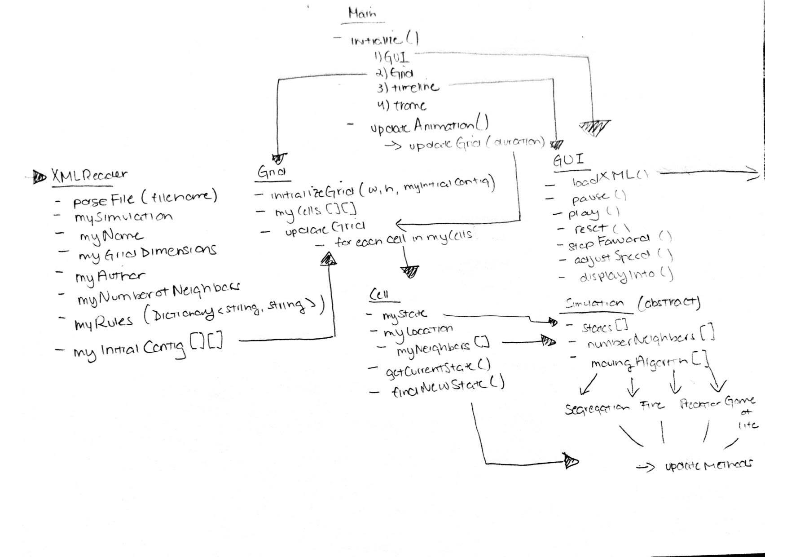
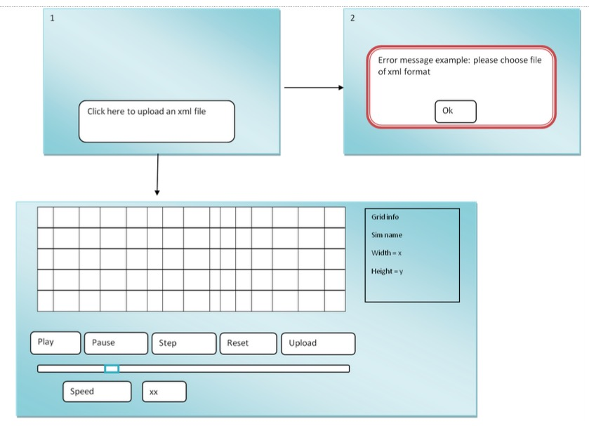

# cellsociety

Project Plan
=======
###Introduction
In this project, we are creating a program that lets the user specify attributes, rules, and the presentation for four different types of Cellular Automata simulations. 

To make the program flexible, we use the Model-Controller-Interface. We separate the GUI from the backend logic where all the computation is done. The controller accepts the input from the user and parses it into the attributes and rules that are going to be used by the model or the interface. The model manages the data, logic and rules of the program. The Interface component contains the user interface, the grid, and the output. It is also where the user specifies the rules and attributes to the program either by uploading fillies or by selecting them from options on the GUI. 

We also ensure flexibility of the program by making classes express behavior to the user but in reality they delegate the implementation of methods to other classes. 

To implement the open-closed principle, we only use private attributes with getters and setters. We also create abstract classes that contain all common methods to the different simulations, and override the methods afterwards. Hence every time we need to add a new simulation, we do not need to create the methods for it again. In this way we avoid code duplicity, and make it more efficient to extend the project. 

###Overview
Our design will include six main classes: the XMLReader class, Main class, Grid class, Cell class, GUI class, and Simulation class. There will be four additional classes--SpreadingOfFire, GameOfLife, Predator, and Schelling--that will inherit from the Simulation super class. 

The Main class will be the code in which the main components of the program are initialized and then run during the animation. This class will contain two methods: initialize and updateAnimation. The initialize method will create a GUI object and a Grid object to produce the user interface in which the application will be animated. In addition, this method will create a timeline object to run the animation within the grid. The updateAnimation method will create a frame that will call a method from the the Grid class to update the grid according to a specified duration of time. This duration of time will not be a constant because it can be changed from the speed slider element of the GUI.

The XMLReader class will be the class by which the game reads the configuration XML files that specify the rules and parameters of each simulation. This class will have the method parseXML(file). In that method, it will assign values to instance variables, mySimulation, myName, myGridDimensions, myAuthor, and myNumberOfNeighbors. In addition, it will populate myRules, which will be a Dictionary<string,string> where the key describes the action and the value holds the specific rule parameters and populate myInitialConfiguration, which will be a 2D object array containing the initial states of each cell. The GUI class' loadXML method will create an instance of the XMLReader class and in turn parse the XML in order to generate the initial state the GUI.

THe Grid class will be the object that creates and stores the grid in which the animation is running. It will have an instance variable myCells, which will be a 2D array of Cells, such that the Grid can access all the cells in the animation. The class will have two methods: initializeGrid and updateGrid. The initializeGrid method will use the information stored in the XMLReader class and will be called in the GUI class' loadXML method once a file has been successfully loaded and the data has been validated. The Grid window should be blank before the initializeGrid method is called, but then be populated with cells and states once the file has been loaded.The updateGrid method will simultaneously update the states of all the cells in the grid after the alloted update time according to the rules of the simulation. 

The Cell class will be the class that represents each individual cell object in the grid. All of the cells for the grid will be created in the Grid class through the initializeGrid method and will be subject to change each time a new configuration file is loaded. The cell will store its state, its location, and myNeighbors (an array of its neighboring cells). It will have methods to getCurrentState and findNextState. The findNextState method uses the rules for the simulation being used and determines the next state of the cell, however it does not automatically update the cell once a new state has been determined in order to update the grid simultaneously. These cell objects will be accessible by the Grid and each cell will be called upon in the Grid class' updateGrid method to change the state of the cell of the next state.  

The GUI class will be the class in which the user interface of the program is initialized and created. The class will create buttons to pause, play, reset, and step forward the animation and to loadXML. These buttons will have event handlers to indicate that when the button is pressed, the timeline will be set to RUNNING or PAUSED. There will be a sliding bar to control the speed of animation and a text box to display some of the configuration information from the XML file. The sliding bar will assign a value of the time to update the game. None of the buttons will be active until the loadXML button has been pressed and an XML file has been loaded. Once an XML file has been successfully loaded and validated, the grid will automatically be generated into its initial configuration.

The Simulation class and its inherited classes SpreadingOfFire, GameOfLife, Predator, and Schelling will have properties like possibleStates[] and attributes such as the probability of being killed in different simulations. In addition, it will have a method to store the actions performed when findNewState is performed in each simulation. This method will be called by the cell updateCell method based on the simulation type. These simulation objects will be created once the type of simulation has been determined from the reading the XML file. These objects will be used by the Cell class in order to determine the getNextState for each type of simulation.

The overview of the design is this:

###User Interface
When the program first starts, a window with a button that promotes the user to select an xml file will appear. Once the file is selected the backend logic of the program will do input validation on the type of the file as well as its formats. A message in a new small window will appear in case of input error. Then the backend logic of the program will parse the file to get information pertained to the GUI among other specification. Once this is the processed, the user will see in the middle of the screen a grid that looks like a chess board. On the board the user will see the initial configuration for the simulation specified in the xml file. Some cells will be occupied other will not.

In addition to the main grid, there will be five buttons: upload new xml file, play, step, reset, and pause. There will also be a slide (speed) for the user to determine the rate at which the simulation will change.

Furthermore, the user will see text on one side of the window that shows all current attributes of the GUI. During any simulation the user can stop it and upload a new file to start another simulation. At this point the grid will be updated to reflect the new changes.

The GUI class contains the attributes and methods that are common to all simulations:

Attributes:
* myheight
* mywidth
* myCells[int][int]

 
Methods:
* getmyheight() returns an int
* getmywidth() returns an int
* pause() that stops the program
* play()
* Step()

The image for the user interface is:

 

###Design Details
The project consists of Main class that contains methods to initialize the GUI and grids. It also consists of Simulation class with four additional classes--SpreadingOfFire, GameOfLife, Predator, and Schelling--that will inherit from the Simulation super class.

All these additional simulation classes call the CellAnimation and Grid classes as required during the process of simulation. Similarly, each of the simulation classes also have their own methods that have functions specific to the simulation roles. For example, there is a GameOfLife class that has the methods that deal with the function related to the ones required in the GameOfLife class. However, it will also call other methods from other classes as per required.

The justification for the given use cases using our code structure is as follows:

#####Apply the rules to a middle cell: set the next state of a cell to dead by counting its number of neighbors using the Game of Life rules for a cell in the middle (i.e., with all its neighbors)

To complete this use case, the relevant XML file will be uploaded through GUI, which the XMLReader class will parse using the parseXML method. When the simulation is started the GameOfLife class will be called. This class consists of the methods that satisfies the rules of the game. This method would call the getCurrentStatus() method from the CellAnimation class. With the getCurrentStatus method, it will be able to know its status as either alive or dead. If it is dead then it can not be set as dead. If it is alive, then will call the middleCell method in GameOfLIfe class where it will then look through its neighbors using the myNeighborCell method. It will then loop through the status(live, dead) and if in doing so if it finds there are fewer than two live neighbours or more than three live neighbours, then its next status would be set to dead.

#####Apply the rules to an edge cell: set the next state of a cell to live by counting its number of neighbors using the Game of Life rules for a cell on the edge (i.e., with some of its neighbors missing)

To complete this use case, the similar process as in the first use case would be applied till the getCurrentStatus method. getCurrentStatus method would inform the current status of that cell as  . This will then look through its neighbors using the myNeighborCell method. It will then loop through the status(live, dead) and if in doing so if it finds there are fewer than two live neighbours or more than three live neighbours, then its next status would be set to dead.

#####Move to the next generation: update all cells in a simulation from their current state to their next state and display the result graphically

To update all cells in a simulation from their current state to their next state, call the updateGrid() method in the Grid class. Also, call the displayInfo() method from the GUI class that will display the graphical result.

#####Set a simulation parameter: set the value of a parameter, probCatch, for a simulation, Fire, based on the value given in an XML fire

To set the simulation parameter, load the XML file using the load button in the GUI. The loadXML method in XMLReader class parses it into the instance variables. Hence, the parameter probCatch would be set to instance variable myParameter there.

#####Switch simulations: use the GUI to change the current simulation from Game of Life to Wator

To switch the simulations, press the reset button that will call the reset button in the GUI class. Then the XML file for Wator can be uploaded using upload button that will call loadXML method and subsequently call parseXML method from XMLReader class. So, the new simulation will be loaded and initialized. Hence, the simulation for Wator will begin.

###Design Considerations
There were two main design issues that the group encountered when making decisions about how to structure classes. The first issue was when deciding how the XML file would format the rules of the game because each simulation has a different set of actions that do not necessarily overlap with each other. We decided for now that we would store them in the form of a dictionary so that there would be key elements that each simulation type would look for such that if a given key does not exist for a simulation type, it will not look for that entry in the dictionary. We thought that the pros of this were that the elements of the rules would be flexible for each type of simulation. The cons are that they are only stored as strings, and as such they will have to be converted to other methods later on. For this, we had the assumption that the formats for every single XML file of each simulation will be the same and that the group will be able to express the details of the rules in succinct regulated strings such that they will be understood by coding logic in other classes. 

The second main design issue that the group encountered and that still has not been resolved is the question of how to structure the Simulation class and its inherited classes and how they will interact with the Cell objects. Because not all of the simulations have rules that fall under the same category, it is very unlikely that the main simulation class will have too many method in common. The main elements that we found in common were the possible states, the number of neighbors, and perhaps algorithms for moving to different cells that would be in common. From there on, there would have to be subclasses that store the rules for updating cells. One idea was to also have additional classes to represent each state of each simulation because they would be able to store the update rules for each state. The pro of this decision would be that it would be easy to differentiate the rules between each type of state. The cons are that it is definitely possible that we will be asked to create and use another type of simulation. In that case it would require a lot of work to develop another type of simulation because new classes would have to be created for not only the simulation, but also all of the states that are part of the simulation.The other option would be to only have the inherited classes for each simulation and then have different options for updating depending on the state of the cell. This would be slightly more complex in the logic because it would involve creating more cases that would need to avoid the use of if statements. We were not able to fully resolve the issue and so we are deciding to leave that decision to when we can determine how the XML file will store the rules and how easily they will be translated into coding logic. 

For the program overall, there are assumptions that have been made for the design as it is. We have assumed that no values aside from the speed will be changed during the animation, such as the dimensions of the grid, the rate at which new blocks are reproduced, etc. By doing this, the GUI will not have to account for user input during animation and the classes will also not have to implement update methods for those settings. The other assumptions that were made were that the XML files will have all the necessary information to run a simulation and that all the XML files will be formatted in the same way such that the rules can be interpreted by coding logic. In addition, there is an assumption that all the simulations added will have a relatively small number of rules so that a new inherited class from Simulation can be easily created and implemented. The main dependencies that impact the design are the dependencies of the GUI with the animation of the grid and the dependencies between the cell objects and the simulation classes. For the GUI, it relies on the timeline created in the Main class so the timeline must be accessible in that class. For the cell objects and the simulation classes, all the rules must be able to be implemented for a single cell object in order for the simulation to work, particularly for cells in which the states can move to random cells on the grid. This behavior will be crucial in the dependencies for these two classes.

###Team Resposibilities
The team responsibilities are divided as follows:
* XML portion - Elsie Ling
* Backend logic - Abhishek Upadhyaya Ghimire
* GUI - Sally Merza
